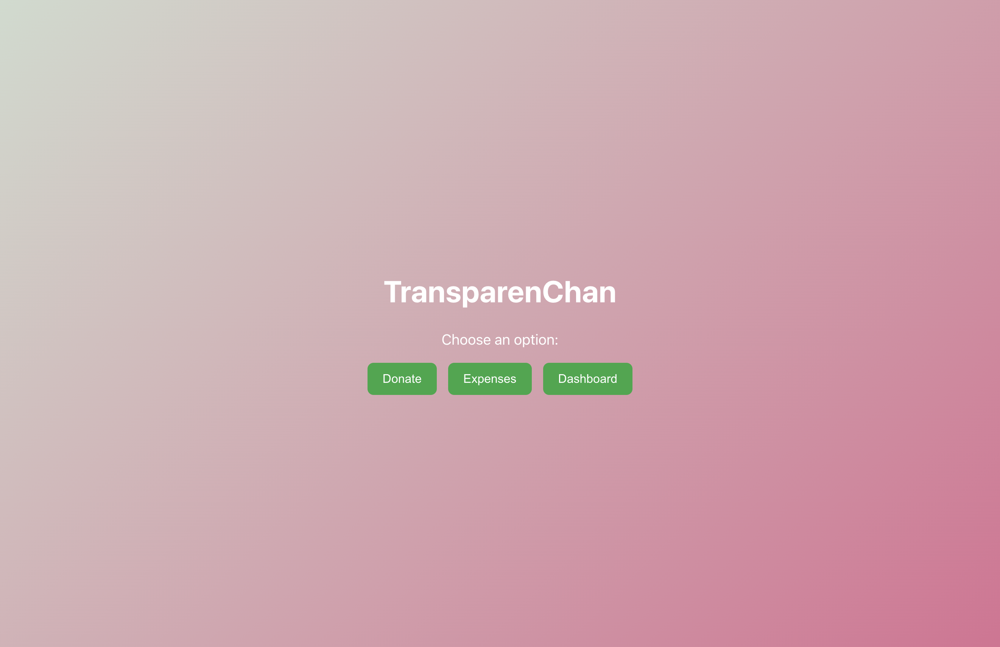
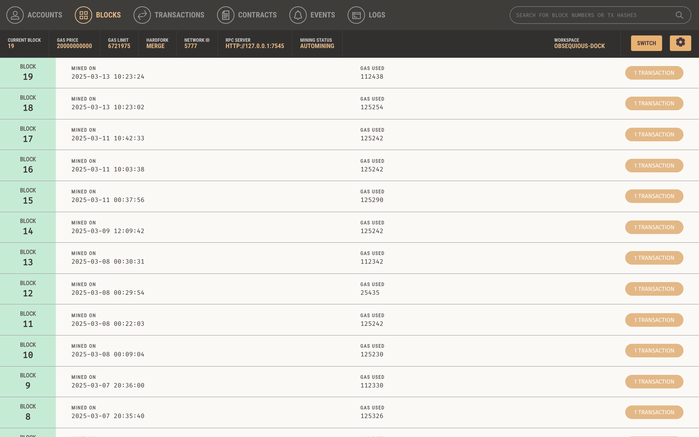

# Transparenchan

## Overview
**Transparenchan** is a **decentralized application (DApp)** built on the **Ethereum blockchain** to enhance transparency, security, and trust in digital transactions. This project leverages **smart contracts** to ensure immutable and verifiable records of interactions.

The application features a **client-server architecture**, where users can interact with the blockchain through a **React.js frontend** and a **Node.js backend**. It also supports **Metamask wallet integration** for seamless blockchain transactions.

---

## Features
✅ **Blockchain-Powered Transparency** – Transactions and records are immutable and publicly verifiable.  
✅ **Decentralized Storage** – Eliminates intermediaries and ensures trustless execution of smart contracts.  
✅ **Secure Smart Contracts** – Uses **Solidity** for tamper-proof transaction logic.  
✅ **Client-Server Integration** – Smooth interaction between **frontend, backend, and Ethereum network**.  
✅ **User Authentication** – Secure login and identity verification through blockchain.  
✅ **Testing Framework** – Implements **Mocha & Chai** for rigorous smart contract testing.  

---

## Screenshots

### **1. Home Page**


### **2. Donate Page**


### **3. Expense Page**


### **4. Dashboard Page**


### **5. Metamask Permission Popup**


### **6. Ganache Blocks Page**


### **7. Ganache Transactions Page**


### **8. Ganache Events Page**


---

## Tech Stack
| Layer          | Technology |
|---------------|-----------|
| **Frontend**  | React.js  |
| **Backend**   | Node.js, Express.js |
| **Blockchain**| Ethereum (Solidity, Truffle) |
| **Testing**   | Mocha, Chai |
| **Wallet**    | Metamask |
| **Database**  | IPFS (for decentralized storage) |

---

## Installation & Setup

### Prerequisites
Ensure you have the following installed:
- [Node.js](https://nodejs.org/)
- [Truffle](https://www.trufflesuite.com/)
- [Ganache](https://www.trufflesuite.com/ganache) (for local blockchain testing)
- [Metamask](https://metamask.io/) (for blockchain interaction)

### Steps
1. **Clone the Repository**
   ```sh
   git clone https://github.com/Jayant420Dhidhi/transparenchan.git
   cd transparenchan
   ```

2. **Install Dependencies**
   ```sh
   npm install
   ```

3. **Compile Smart Contracts**
   ```sh
   truffle compile
   ```

4. **Deploy Smart Contracts**
   ```sh
   truffle migrate --network development
   ```

5. **Run the Application**
   ```sh
   npm start
   ```

---

## Folder Structure
```
transparenchan/
│── build/           # Compiled smart contracts
│── client/          # Frontend application (React.js)
│── contracts/       # Solidity smart contracts
│── migrations/      # Deployment scripts for Truffle
│── server/          # Backend server (Node.js, Express.js)
│── test/            # Smart contract tests (Mocha, Chai)
│── truffle-config.js # Truffle configuration file
│── images/          # Screenshots of the application
```

---

## Smart Contracts
- **TransparencyContract.sol** – Main contract handling transactions and storage.
- **Authentication.sol** – Manages user authentication on the blockchain.

---

## Testing
To run tests for smart contracts, execute:
```sh
truffle test
```

---

## License
This project is licensed under the **MIT License**.

---

## Contribution
Contributions are welcome! If you’d like to contribute:
1. Fork the repository.
2. Create a feature branch (`git checkout -b feature-branch`).
3. Commit your changes (`git commit -m "Add new feature"`).
4. Push to the branch (`git push origin feature-branch`).
5. Open a pull request.

Happy coding! 🚀
